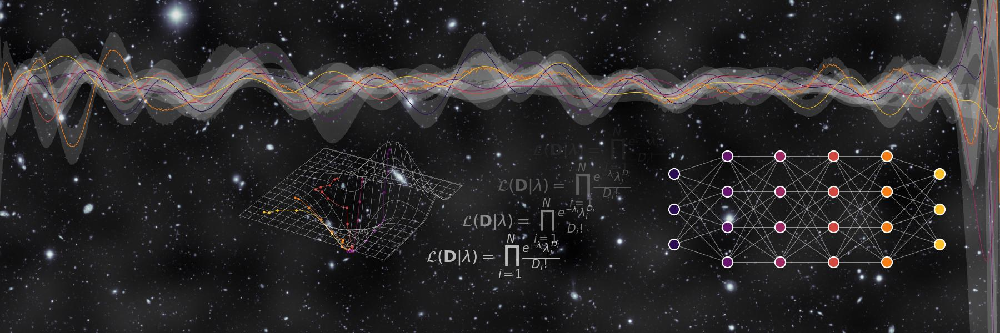

# Welcome to my GitHub page!

I'm a postdoctoral researcher at the [Center for Astrophysics](https://www.cfa.harvard.edu). My main research interests include **statistical methods and machine learning** for analysis of low counts data in general. I'm also interested in methods to combine data from multiple instruments. I'm the lead developer of the open source software package [Gammapy](https://gammapy.org), sub-package maintainer of [Astropy](https://astropy.org) and a member of the [CHASC astro-statistics collaboration](https://hea-www.harvard.edu/astrostat/). I'm also editor for the Astronomy and Astrophysics track of the Journal of Open Source Software [JOSS](https://joss.theoj.org).

Here you can find an overview of my activities on GitHub:
